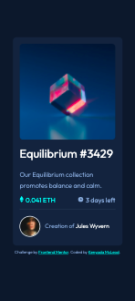

# Frontend Mentor - NFT preview card component solution

This is a solution to the [NFT preview card component challenge on Frontend Mentor](https://www.frontendmentor.io/challenges/nft-preview-card-component-SbdUL_w0U). Frontend Mentor challenges help you improve your coding skills by building realistic projects. 

## Table of contents

- [Overview](#overview)
  - [The challenge](#the-challenge)
  - [Screenshot](#screenshot)
  - [Links](#links)
- [My process](#my-process)
  - [Built with](#built-with)
  - [What I learned](#what-i-learned)
  - [Continued development](#continued-development)
  - [Useful resources](#useful-resources)
- [Author](#author)
- [Acknowledgments](#acknowledgments)

## Overview

### The challenge

Users should be able to:

- View the optimal layout depending on their device's screen size
- See hover states for interactive elements

### Screenshot




### Links

- Solution URL: [GitHub Repo](https://github.com/kjm2023/fm-nft-preview-card-component-main.git)
- Live Site URL: [GitHub Page](https://kjm2023.github.io/fm-nft-preview-card-component-main/)

## My process

### Built with

- Semantic HTML5 markup
- CSS custom properties
- Flexbox
- Mobile-first workflow

### What I learned

I learned to appreciate the varying approaches to a single solution. In my search of ways to create an image overlay, I found the pseuodo element to be rather difficult to understand. In lieu of this approach, I used a combination of positioning, min-width, max-width, flexbox and the sibling CSS selector.

To see how you can add code snippets, see below:

```html
<div class="primaryimagecontainer" >
    
    <div>
      <svg width="48" height="48" xmlns="http://www.w3.org/2000/svg">
        <g fill="none" fill-rule="evenodd"><path d="M0 0h48v48H0z"/>
          <path d="M24 9C14 9 5.46 15.22 2 24c3.46 8.78 12 15 22 15 10.01 0 18.54-6.22 22-15-3.46-8.78-11.99-15-22-15Zm0 25c-5.52 0-10-4.48-10-10s4.48-10           10-10 10 4.48 10 10-4.48 10-10 10Zm0-16c-3.31 0-6 2.69-6 6s2.69 6 6 6 6-2.69 6-6-2.69-6-6-6Z" fill="#FFF" fill-rule="nonzero"/>
        </g>
      </svg>
    </div>
</div>
  ```
  ```css
  .primaryimagecontainer {
    position: relative;
    max-width: 100%;
    align-self: center;
}

.primaryimagecontainer img {
    max-width: 100%;
    border-radius: 10px;
}

.primaryimagecontainer div {
    border-radius: 10px;
    min-width: 100%;
    /* padding: 42%; */
    min-height: 100%;
    position: absolute;
    top: 0;
    background-color: rgba(0, 255, 247,.5);
    display: none;
}

.primaryimagecontainer img:hover~div {
    display: flex;
    flex-direction: column;
    justify-content: center;
    align-items: center;
    transition: .4s;
}
```

### Continued development

I am especially interested in exploring ways to allow for a smoother transition between breakpoints. Currently, I have a few flickers on the screen. Additionally, I want the card remain the same size (for the most part) no matter the screen size. I would love to receive feedback on approaches for that.

### Useful resources

- [A Complet Gide to Flexbox - CSS Tricks](https://css-tricks.com/snippets/css/a-guide-to-flexbox/) - This visual flexbox cheatsheet is a regular reference for me.
- Let us not forget about the [Google](https://google.com)

## Author

- Frontend Mentor - [@kjm2023](https://www.frontendmentor.io/profile/kjm2023)


## Acknowledgments

Shout out to my amazing coding cohort at [GDI (Girl Develop It!)](http://girldevelopit.org).


